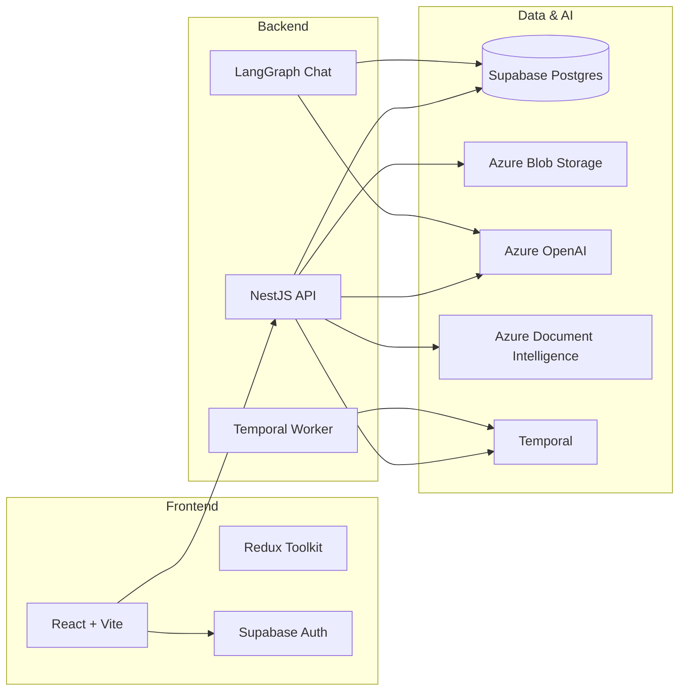

# Memorang

AI-powered learning platform that turns uploaded PDFs into interactive study plans and quiz-style lessons.

**Flow:** Upload a PDF → ingest & analyze with Azure → generate a study plan → approve topics → take an AI-generated MCQ lesson with an optional coach chat.

---

## Links

| | URL |
|---|-----|
| **Live Application** | https://memorang.tickertom.com |
| **Demo Video (Loom)** | https://www.loom.com/share/7c8901770dcd4af1919670632fa2eb27 |
| **Backend API** | https://memorang-api.tickertom.com |
| **Temporal UI** | https://memorang-api-temporal.tickertom.com |

In production, the frontend proxies API calls through `/api` on the same origin. The standalone API host is available for direct access and debugging.

### Local development

| Service | URL |
|---------|-----|
| Frontend (Vite) | http://localhost:5173 |
| Backend (NestJS) | http://localhost:3001 |
| Temporal gRPC | localhost:7233 |
| Temporal UI | http://localhost:8080 |
| Temporal Postgres | localhost:5433 |

---

## Architecture



| Layer | Stack |
|-------|-------|
| Frontend | React 18, Vite, TypeScript, React Router, Redux Toolkit |
| Backend | NestJS 10, Node 20, TypeScript |
| Auth | Supabase (JWT; backend verifies Bearer tokens) |
| Database | Supabase Postgres + RLS |
| File storage | Azure Blob Storage (PDFs + extracted images) |
| LLM / embeddings | Azure OpenAI (chat, embeddings, vision) |
| PDF analysis | Azure Document Intelligence |
| Workflows | Temporal (`document-ingestion` task queue) |
| Chat state | LangGraph + Postgres checkpointer |
| Tracing | LangSmith (optional) |
| Production secrets | Doppler |
| Deployment | Kubernetes on Azure (ACR images) |

---

## Repository structure

Backend and frontend are separate Node projects (no root `package.json`).

```
Memorang/
├── backend/                         # NestJS API + Temporal worker
│   ├── src/
│   │   ├── main.ts                  # API entry (port 3001)
│   │   ├── app.module.ts            # Root module wiring
│   │   ├── common/
│   │   │   ├── guards/              # SupabaseAuthGuard
│   │   │   └── decorators/          # @CurrentUser()
│   │   ├── types/
│   │   │   └── learning.ts          # Core domain types (Learning, stages)
│   │   ├── learnings/               # Learning CRUD, PDF upload, reprocess
│   │   │   ├── learnings.controller.ts
│   │   │   ├── learnings.service.ts
│   │   │   └── dto/
│   │   ├── study-plan/              # Plan generation, approval, plan chat (SSE)
│   │   │   ├── study-plan.controller.ts
│   │   │   ├── study-plan.service.ts
│   │   │   ├── types.ts
│   │   │   └── dto/
│   │   ├── lesson/                  # MCQ lessons, answers, coach chat (SSE)
│   │   │   ├── lesson.controller.ts
│   │   │   ├── lesson.service.ts
│   │   │   ├── types.ts
│   │   │   └── dto/
│   │   ├── ingestion/               # Starts Temporal ingestion workflows
│   │   ├── temporal/
│   │   │   ├── worker.ts            # Temporal worker entry
│   │   │   ├── temporal.service.ts
│   │   │   ├── workflows/           # document-ingestion.workflow.ts
│   │   │   └── activities/          # document.activities.ts
│   │   ├── langgraph/               # Streaming chat graphs + Postgres checkpointer
│   │   ├── supabase/                # Admin client + JWT verification
│   │   ├── azure/                   # Blob storage + SAS URLs
│   │   ├── azure-openai/            # Chat, embeddings, vision JSON
│   │   ├── document-intelligence/   # PDF layout analysis
│   │   ├── image-classification/    # Figure classification heuristics + vision
│   │   └── health/                  # GET /health
│   ├── evals/                       # Deterministic prompt/retrieval tests
│   ├── Dockerfile
│   └── .env.example
│
├── frontend/                        # React SPA
│   ├── src/
│   │   ├── main.tsx                 # App entry
│   │   ├── App.tsx                  # AuthProvider + Redux + Router shell
│   │   ├── index.css                # Global design system + feature styles
│   │   │
│   │   ├── contexts/
│   │   │   └── AuthContext.tsx      # AuthProvider, useAuth()
│   │   │
│   │   ├── router/
│   │   │   ├── AppRoutes.tsx        # Centralized route definitions
│   │   │   └── ProtectedRoute.tsx   # Auth gate for /dashboard/*
│   │   │
│   │   ├── layouts/
│   │   │   └── DashboardLayout.tsx  # Sidebar + nested dashboard routes
│   │   │
│   │   ├── pages/                   # Top-level route screens
│   │   │   ├── Login.tsx
│   │   │   ├── Signup.tsx
│   │   │   └── LearningPage.tsx     # /dashboard/learnings/:id
│   │   │
│   │   ├── components/
│   │   │   ├── auth/
│   │   │   │   ├── AuthLayout.tsx   # Shared login/signup hero shell
│   │   │   │   ├── LoginForm.tsx
│   │   │   │   └── SignupForm.tsx
│   │   │   ├── dashboard/
│   │   │   │   └── DashboardHome.tsx
│   │   │   ├── learnings/
│   │   │   │   ├── Sidebar.tsx
│   │   │   │   ├── LearningDetail.tsx
│   │   │   │   ├── AddLearningModal.tsx
│   │   │   │   ├── PdfUploadZone.tsx
│   │   │   │   ├── StudyPlanWorkspace.tsx
│   │   │   │   ├── LessonWorkspace.tsx      # Lesson orchestrator
│   │   │   │   ├── PlanTopicTree.tsx        # Shared topic/subtopic picker
│   │   │   │   ├── AgentChatPanel.tsx       # Shared streaming chat UI
│   │   │   │   └── lesson/
│   │   │   │       ├── LessonQuestionCard.tsx
│   │   │   │       ├── LessonSummary.tsx
│   │   │   │       ├── LessonRadarChart.tsx
│   │   │   │       ├── CoachChatDrawer.tsx
│   │   │   │       └── RegenerateQuizModal.tsx
│   │   │   └── ui/                  # Reusable primitives
│   │   │       ├── Button.tsx
│   │   │       ├── Input.tsx
│   │   │       ├── PasswordInput.tsx
│   │   │       ├── Modal.tsx
│   │   │       ├── Badge.tsx
│   │   │       ├── Spinner.tsx
│   │   │       ├── LoadingScreen.tsx
│   │   │       └── ErrorAlert.tsx
│   │   │
│   │   ├── store/
│   │   │   ├── index.ts             # Redux store setup
│   │   │   └── learningsSlice.ts    # Learning list CRUD + upload state
│   │   │
│   │   ├── hooks/
│   │   │   ├── usePolling.ts        # Shared interval polling
│   │   │   └── useIngestionTiming.ts
│   │   │
│   │   ├── lib/
│   │   │   ├── api.ts               # REST + SSE API client
│   │   │   ├── sse.ts               # Shared SSE stream parser
│   │   │   ├── supabase.ts          # Supabase client + token helper
│   │   │   ├── runtimeConfig.ts     # Runtime env (window.__APP_CONFIG__)
│   │   │   ├── formatDuration.ts
│   │   │   └── stageIcons.tsx       # Centralized stage icon map
│   │   │
│   │   └── types/
│   │       └── learning.ts          # Frontend domain types
│   │
│   ├── nginx.conf                   # Production reverse proxy (/api → backend)
│   ├── docker/                      # Doppler → app-config.js startup script
│   └── .env.example
│
├── supabase/
│   └── migrations/                  # Postgres schema (run in order 001–005)
│       ├── 001_initial.sql
│       ├── 002_ingestion_pipeline.sql
│       ├── 003_study_plan_and_chat.sql
│       ├── 004_lessons_and_quizzes.sql
│       └── 005_lesson_analytics.sql
│
├── k8s/                             # Production Kubernetes manifests
│   ├── ingress.yaml                 # TLS + routing for all public hosts
│   ├── frontend/                    # Frontend deployment + service
│   ├── backend/                     # API + worker deployments + service
│   ├── temporal/                    # Temporal server, UI, Postgres secret setup
│   └── secrets/                     # Doppler token templates + setup scripts
│
├── docker-compose.temporal.yml      # Local Temporal stack
└── .github/workflows/               # CI: build & push images to Azure Container Registry
```

### Frontend layering

| Layer | Responsibility |
|-------|----------------|
| `pages/` | Route-level screens; thin wrappers that compose feature components |
| `layouts/` | Persistent shells (dashboard sidebar + main content area) |
| `router/` | Route config and auth guards |
| `contexts/` | Cross-cutting React context (auth session) |
| `components/learnings/` | Domain UI for the learning workflow |
| `components/ui/` | Generic, reusable UI primitives |
| `store/` | Client state for the learning list (server workspace state lives in feature components) |
| `lib/` | API client, Supabase, utilities |
| `hooks/` | Reusable React hooks |
| `types/` | TypeScript domain types mirrored from the API |

---

## Product flow

### Learning stages

| Stage | Meaning |
|-------|---------|
| `empty` | Learning created, no PDF yet |
| `study_upload_pending` | PDF upload in progress |
| `study_uploaded` | PDF stored; ingestion running or complete |
| `user_approved_study` | Study plan approved; ready for lesson |
| `lesson_in_progress` | User taking the MCQ lesson |
| `lesson_complete` | Lesson finished |

### Ingestion pipeline (Temporal)

When a PDF is uploaded, the `documentIngestionWorkflow` runs:

1. **Initialize** — reset artifacts, set status `queued`
2. **Document Intelligence** — Azure DI extracts layout, paragraphs, figures
3. **Extract & classify figures** — download images, classify with heuristics + vision
4. **Persist chunks** — store text chunks in Supabase
5. **Embed chunks** — Azure OpenAI embeddings → vector search
6. **Finalize** — mark ingestion `completed`

The worker must be running for ingestion to complete (`npm run start:worker`).

---

## Local setup

### Prerequisites

- **Node.js 20**
- **Docker** (for local Temporal)
- Accounts / resources for:
  - [Supabase](https://supabase.com) — auth + Postgres
  - [Azure](https://portal.azure.com) — Blob Storage, OpenAI, Document Intelligence
  - [LangSmith](https://smith.langchain.com) (optional) — LLM tracing

### 1. Database (Supabase)

Create a Supabase project and run migrations in order:

```bash
# Apply via Supabase SQL editor or CLI
supabase/migrations/001_initial.sql
supabase/migrations/002_ingestion_pipeline.sql
supabase/migrations/003_study_plan_and_chat.sql
supabase/migrations/004_lessons_and_quizzes.sql
supabase/migrations/005_lesson_analytics.sql
```

You need:
- **Project URL** → `SUPABASE_URL` / `VITE_SUPABASE_URL`
- **Anon key** → `VITE_SUPABASE_ANON_KEY` (frontend)
- **Service role key** → `SUPABASE_SERVICE_ROLE_KEY` (backend only — never expose to frontend)

### 2. Azure services

| Service | Purpose | Backend env vars |
|---------|---------|------------------|
| **Blob Storage** | PDF + image storage | `AZURE_STORAGE_CONNECTION_STRING`, `AZURE_STORAGE_PDF_CONTAINER`, `AZURE_STORAGE_IMAGE_CONTAINER` |
| **Azure OpenAI** | Chat, embeddings, vision | `AZURE_OPENAI_API_KEY`, `AZURE_OPENAI_ENDPOINT`, `AZURE_OPENAI_DEPLOYMENT_NAME`, `AZURE_OPENAI_EMBEDDING_DEPLOYMENT_NAME` |
| **Document Intelligence** | PDF layout analysis | `AZURE_DOCUMENT_INTELLIGENCE_KEY`, `AZURE_DOCUMENT_INTELLIGENCE_ENDPOINT` |

Optional for reasoning-style chat deployments:

```env
AZURE_OPENAI_CHAT_SUPPORTS_TEMPERATURE=true
# or
AZURE_OPENAI_CHAT_TEMPERATURE=0.2
```

### 3. Temporal (local)

```bash
docker compose -f docker-compose.temporal.yml up -d
```

Default connection (already in `.env.example`):

```env
TEMPORAL_ADDRESS=localhost:7233
TEMPORAL_NAMESPACE=default
TEMPORAL_TASK_QUEUE=document-ingestion
```

### 4. Backend

```bash
cd backend
cp .env.example .env   # fill in all values
npm ci
npm run start:dev      # API on :3001
```

In a **second terminal**, start the Temporal worker:

```bash
cd backend
npm run build && npm run start:worker
```

### 5. Frontend

```bash
cd frontend
cp .env.example .env.local
npm ci
npm run dev            # :5173
```

Frontend env vars:

```env
VITE_SUPABASE_URL=https://<project>.supabase.co
VITE_SUPABASE_ANON_KEY=<anon-key>
VITE_BACKEND_URL=http://localhost:3001
```

Vite also proxies `/api` → `http://localhost:3001` if you prefer same-origin calls during dev.

### 6. LangGraph persistence

Set `LANGGRAPH_POSTGRES_URL` to a Postgres connection string (Supabase Postgres works). This stores chat checkpoint state for plan and lesson conversations.

```env
LANGGRAPH_POSTGRES_URL=postgresql://...
LANGGRAPH_POSTGRES_SCHEMA=public
```

### 7. LangSmith (optional)

```env
LANGSMITH_TRACING=true
LANGSMITH_PROJECT=MEMORANG
LANGSMITH_API_KEY=<your-key>
```

---

## Environment variables reference

### Backend (`backend/.env`)

| Variable | Description |
|----------|-------------|
| `SUPABASE_URL` | Supabase project URL |
| `SUPABASE_SERVICE_ROLE_KEY` | Backend admin key (bypasses RLS) |
| `AZURE_STORAGE_CONNECTION_STRING` | Blob storage connection string |
| `AZURE_STORAGE_PDF_CONTAINER` | PDF container name (default: `pdfs`) |
| `AZURE_STORAGE_IMAGE_CONTAINER` | Image container name (default: `extracted-images`) |
| `AZURE_OPENAI_API_KEY` | Azure OpenAI API key |
| `AZURE_OPENAI_ENDPOINT` | Azure OpenAI endpoint URL |
| `AZURE_OPENAI_API_VERSION` | API version (default: `2024-10-21`) |
| `AZURE_OPENAI_DEPLOYMENT_NAME` | Chat deployment name |
| `AZURE_OPENAI_EMBEDDING_DEPLOYMENT_NAME` | Embedding deployment name |
| `AZURE_DOCUMENT_INTELLIGENCE_KEY` | Document Intelligence key |
| `AZURE_DOCUMENT_INTELLIGENCE_ENDPOINT` | Document Intelligence endpoint |
| `TEMPORAL_ADDRESS` | Temporal server address |
| `TEMPORAL_NAMESPACE` | Temporal namespace |
| `TEMPORAL_TASK_QUEUE` | Worker task queue |
| `LANGGRAPH_POSTGRES_URL` | Postgres URL for LangGraph checkpointer |
| `LANGGRAPH_POSTGRES_SCHEMA` | Postgres schema (default: `public`) |
| `LANGSMITH_TRACING` | Enable LangSmith (`true`/`false`) |
| `LANGSMITH_PROJECT` | LangSmith project name |
| `LANGSMITH_API_KEY` | LangSmith API key |
| `PORT` | API port (default: `3001`) |
| `FRONTEND_URL` | CORS origin (default: `http://localhost:5173`) |
| `FIGURE_EXTRACTION_CONCURRENCY` | Parallel figure extraction (default: `12`) |
| `VISION_CLASSIFICATION_CONCURRENCY` | Vision batch size (default: `16`) |

### Frontend (`frontend/.env.local`)

| Variable | Description |
|----------|-------------|
| `VITE_SUPABASE_URL` | Supabase project URL |
| `VITE_SUPABASE_ANON_KEY` | Supabase anon/public key |
| `VITE_BACKEND_URL` | Backend base URL (default: `http://localhost:3001`) |

> **Never commit** `.env`, `.env.local`, `k8s/secrets/doppler-tokens.yaml`, or `k8s/temporal/postgres-secret.yaml`. Templates with `REPLACE_ME` placeholders are safe to commit.

---

## API reference

All endpoints except `GET /health` require:

```http
Authorization: Bearer <supabase_access_token>
```

Base URL: `http://localhost:3001` (local) or `https://memorang-api.tickertom.com` (production).

### Health

| Method | Path | Description |
|--------|------|-------------|
| `GET` | `/health` | Health check |

### Learnings

| Method | Path | Description |
|--------|------|-------------|
| `GET` | `/learnings` | List current user's learnings |
| `POST` | `/learnings` | Create learning `{ title, description? }` |
| `GET` | `/learnings/:id` | Get learning |
| `GET` | `/learnings/:id/status` | Poll ingestion / plan status |
| `PATCH` | `/learnings/:id` | Update title, description, or stage |
| `DELETE` | `/learnings/:id` | Delete learning (+ blob cleanup) |
| `POST` | `/learnings/:id/upload` | Upload PDF (multipart, max 50 MB) |
| `POST` | `/learnings/:id/reprocess` | Restart ingestion workflow |

### Study plan

| Method | Path | Description |
|--------|------|-------------|
| `GET` | `/learnings/:id/plan` | Study workspace (plan, thread, messages) |
| `POST` | `/learnings/:id/plan/regenerate` | Generate plan `{ difficulty }` |
| `PATCH` | `/learnings/:id/plan/topics/:topicId` | Toggle topic `{ included }` |
| `PATCH` | `/learnings/:id/plan/subtopics/:subtopicId` | Toggle subtopic `{ included }` |
| `POST` | `/learnings/:id/plan/approve` | Approve plan |
| `POST` | `/learnings/:id/chat/stream` | SSE plan chat `{ message }` |

**SSE events:** `ack`, `token`, `message`, `plan`, `done`, `error`

### Lesson

| Method | Path | Description |
|--------|------|-------------|
| `GET` | `/learnings/:id/lesson` | Lesson workspace |
| `POST` | `/learnings/:id/lesson/start` | Start or regenerate lesson `{ regenerate? }` |
| `POST` | `/learnings/:id/lesson/:lessonId/questions/:questionId/answer` | Submit answer `{ selectedChoiceIndex, responseTimeMs }` |
| `POST` | `/learnings/:id/lesson/chat/stream` | SSE lesson coach chat `{ message }` |

The frontend API client lives in `frontend/src/lib/api.ts`. SSE parsing is shared via `frontend/src/lib/sse.ts`.

---

## NPM scripts

### Backend

| Script | Command | Description |
|--------|---------|-------------|
| `start:dev` | `nest start --watch` | Dev API server |
| `start:prod` | `node dist/main` | Production API |
| `start:worker` | `node dist/temporal/worker` | Temporal worker |
| `build` | `nest build` | Compile TypeScript |
| `evals` | `node … evals/…` | Run prompt/retrieval evals |
| `type-check` | `tsc --noEmit` | Typecheck |

### Frontend

| Script | Command | Description |
|--------|---------|-------------|
| `dev` | `vite` | Dev server (:5173) |
| `build` | `tsc && vite build` | Production build |
| `preview` | `vite preview` | Preview production build |
| `type-check` | `tsc --noEmit` | Typecheck |

---

## Evals

Backend evals are deterministic and use mocked dependencies (no live Azure/Supabase required):

```bash
cd backend
npm run evals
```

See `backend/evals/README.md` for coverage details.

---

## Production deployment

### Images

CI builds and pushes to Azure Container Registry on push to `master`:

- `tickertom.azurecr.io/memorang-frontend:latest`
- `tickertom.azurecr.io/memorang-backend:latest` (API + worker)

### Kubernetes services

| Deployment | Role |
|------------|------|
| `memorang-frontend-deploy-prod` | nginx SPA + `/api` proxy |
| `memorang-backend-deploy-prod` | NestJS API |
| `memorang-worker-deploy-prod` | Temporal worker |
| `memorang-temporal-deploy-prod` | Temporal server |
| `memorang-temporal-ui-deploy-prod` | Temporal UI |

### Secrets (Doppler)

Production uses [Doppler](https://www.doppler.com) with separate configs:

- `prd_frontend`
- `prd_backend`
- `prd_worker`

Setup:

```bash
./k8s/secrets/setup-doppler-tokens.sh
```

Temporal Postgres credentials are derived from `LANGGRAPH_POSTGRES_URL`:

```bash
DOPPLER_PROJECT=memorang DOPPLER_CONFIG=prd_backend ./k8s/temporal/setup-postgres-secret.sh
```

### Restart deployments

```bash
kubectl rollout restart deployment \
  memorang-backend-deploy-prod \
  memorang-frontend-deploy-prod \
  memorang-worker-deploy-prod \
  memorang-temporal-deploy-prod \
  memorang-temporal-ui-deploy-prod
```

---

## Security notes

- Frontend uses the Supabase **anon key** only; backend uses the **service role key**.
- Never commit real `.env` files or generated k8s secret manifests.
- PDF uploads are limited to 50 MB.
- All learning data is scoped to the authenticated Supabase user via RLS.
